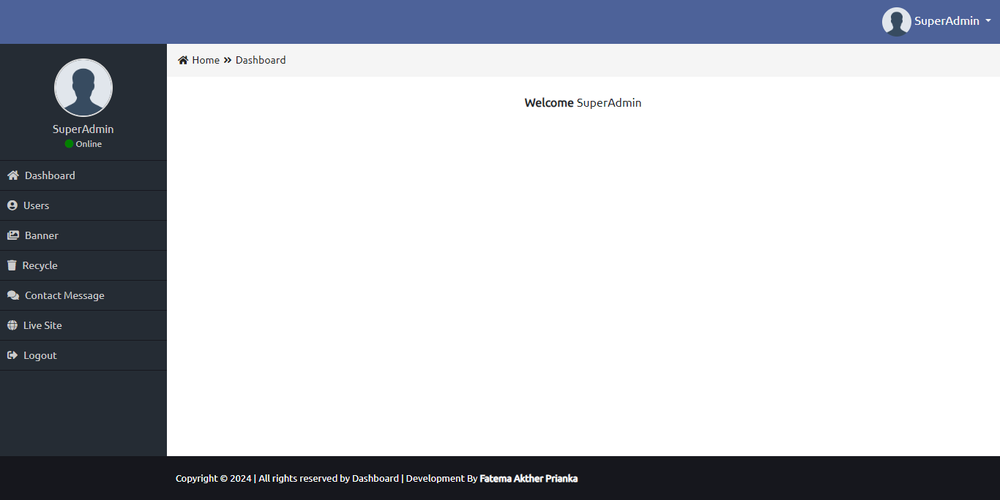
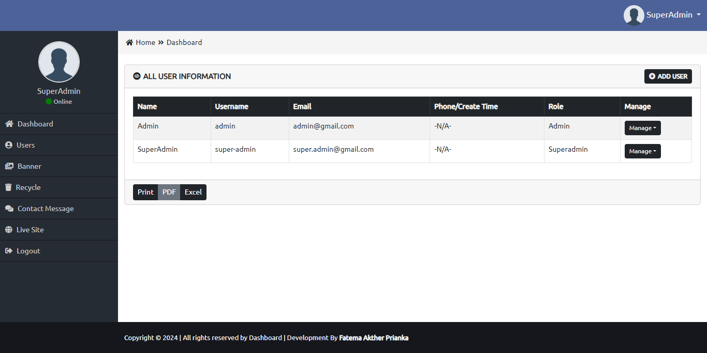
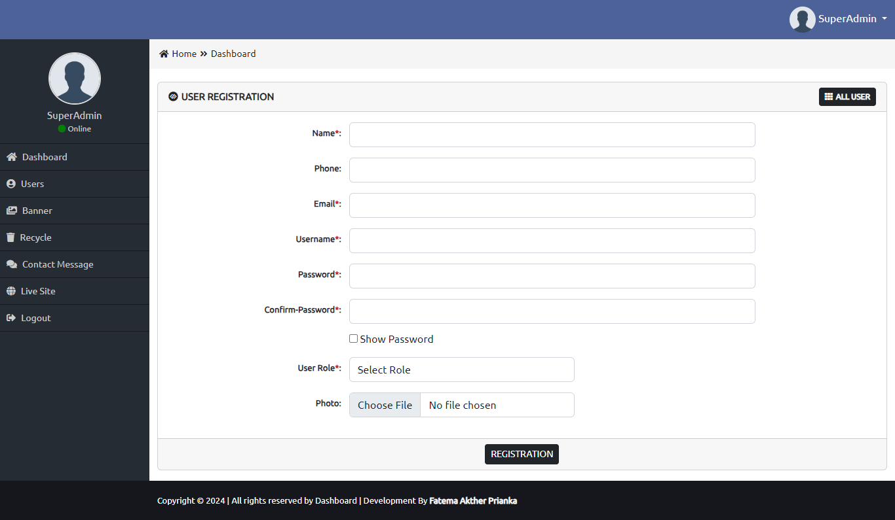
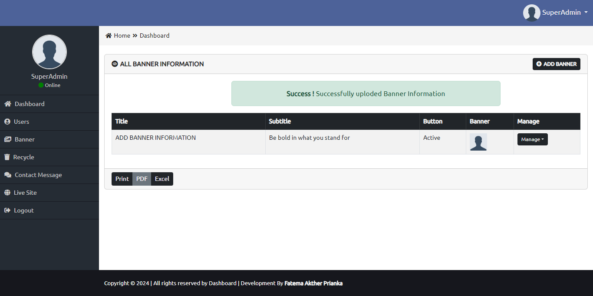
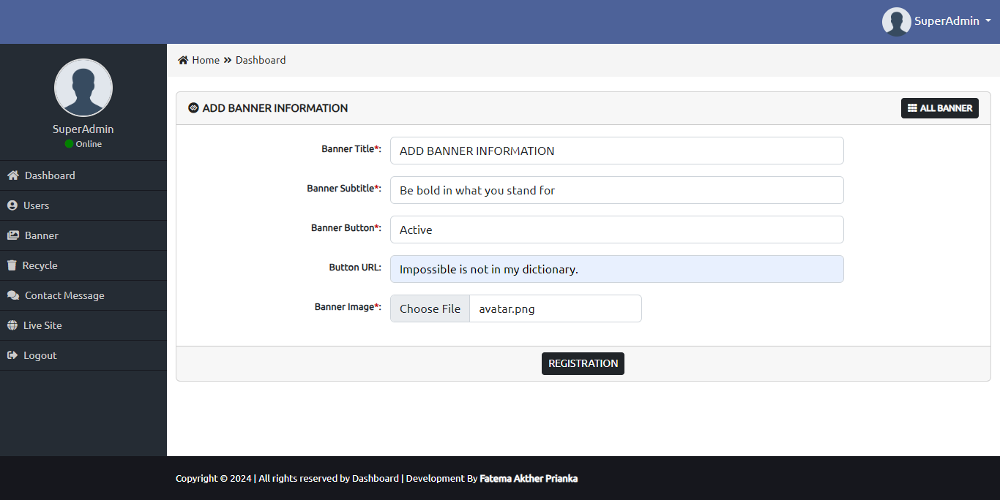
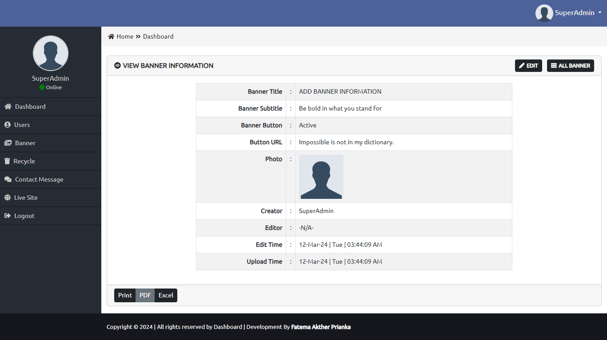
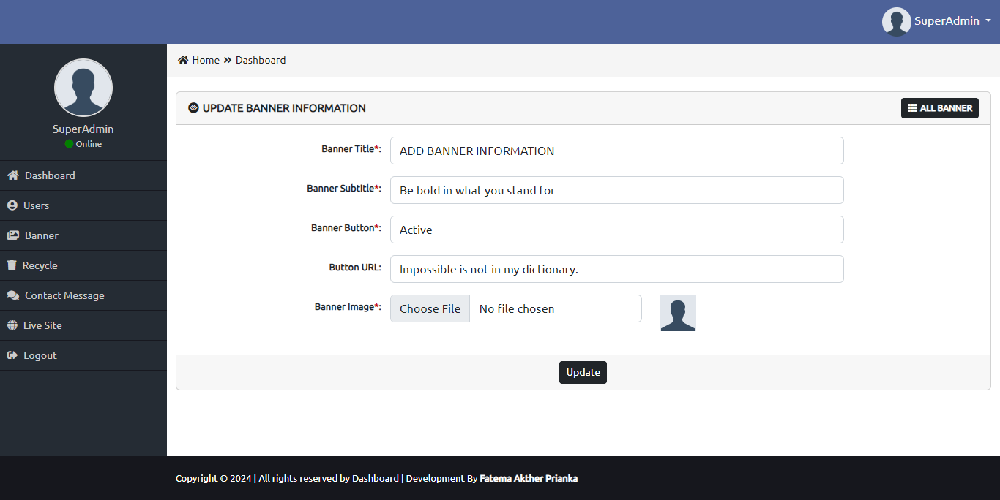
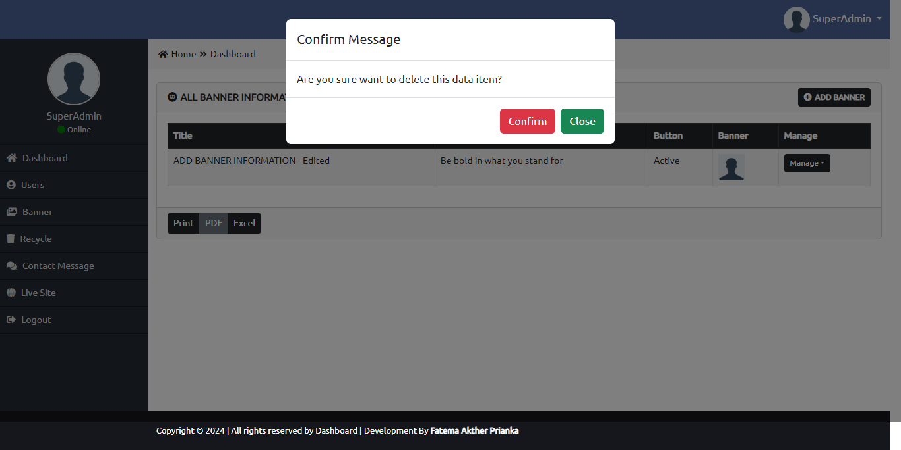
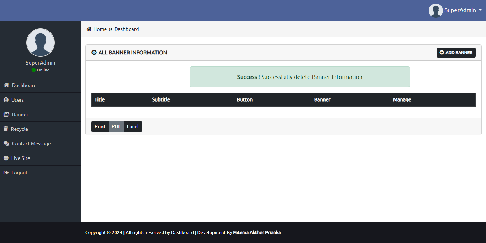
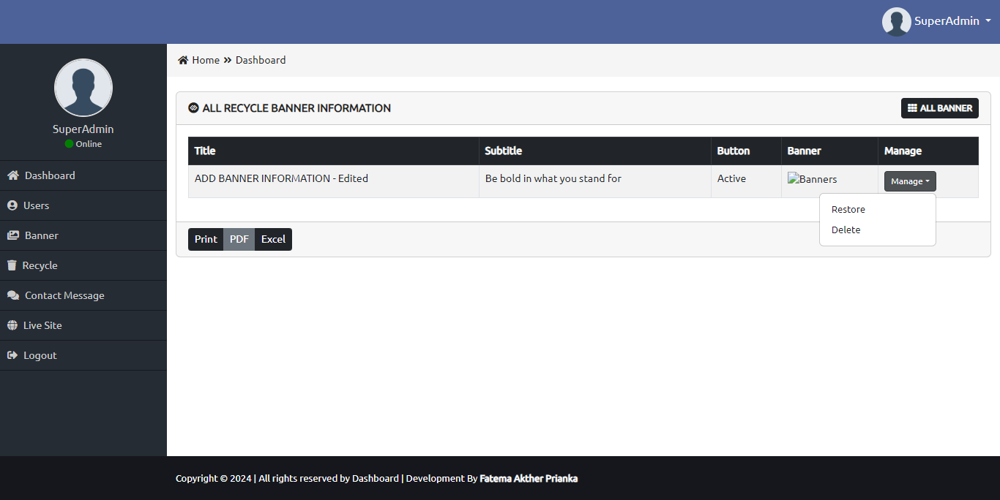

# Admin Panel Laravel CRUD with Role system in Breeze !

It's a simple **Admin Panel Laravel CRUD with Role system** multi page project **With Breeze** can...
 - Create or Add User
 - Assign Role to User
 - Banner
    - Add
    - View
    - Edit 
    - Delete
 - Restore Banner data or can permanently delete from database
 - Login with email and password
 - LogOut

## Author

[Fatema Akther Prianka 🤗](https://github.com/Prianka-Mimi)

## Features

- Add | Edit | Delete - with Success | Error - Flash message

- Delete | Restore - Confirmation with modal

- Validations for User (Unique) | Banner

- Uses of slug | Creator Name & Time | Editor Name & Time

- Single view page 

- Create or Add User and Assign Role to User

- Default User Role - Subscriber

- Uses of Middleware for which Role | Roles - can Access what or not

- Logout ( Custom designed Sidebar ) work through default breeze system

- Uses of Seeder for Role and BackUp User Information

- Uses of Breeze for Authentication and Authorization | Login with email and password

- Used Package Image Intervention version 2 for Image Upload and save to folder

## Has Been Used

 - Html
 - Css
 - Bootstrap
 - Java Script
    - Password toggle (User)
	- JQuery for session flash auto timeout
    - Modal delete through ID

	
## View In Short

**Dashboard**

**All User**

**Add User**

**All Banner**

> All Banner after adding a banner with success session flash message

**Add Banner**

**View Banner**

**Edit Banner**

**Delete with Modal**

**Delete Confirmation message**

**Restore**

  
## Contact

[🌐 Fatema Akther Prianka](https://webdeveloperprianka.netlify.app/)

[Linkedin](https://www.linkedin.com/in/fatema-akther-prianka/)

[FaceBook](https://www.facebook.com/fatemaaktherprianka.webdeveloper)

[Stack Overflow](https://stackoverflow.com/users/23182049/prianka-mimi)
